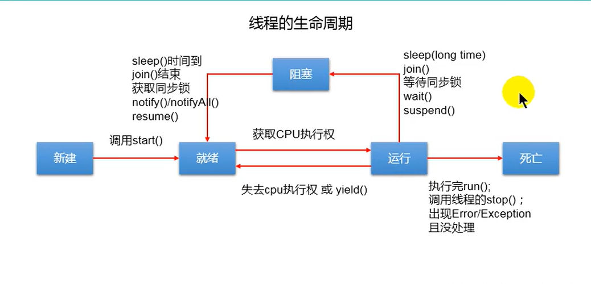

### 生命周期

新建：

当一个Thread类或其子类的对象被声明创建时，新生的线程处于新建状态。

就绪：

处于新建状态的线程被start()后，进入线程队列等待CPU时间片，此时它已经具备了运行的条件，只是没分配到CPU资源。

运行：

当就绪的线程被调度并获取CPU资源时，便进入运行状态，run()方法定义了线程的操作和功能/

阻塞：

在某种特殊情况下，被人为挂起或执行输入输出操作时，让出CPU并临时终止自己的执行，进入阻塞状态

死亡：

线程完成了它的全部工作或线程被提前强制性地中止或出现异常导致结束

