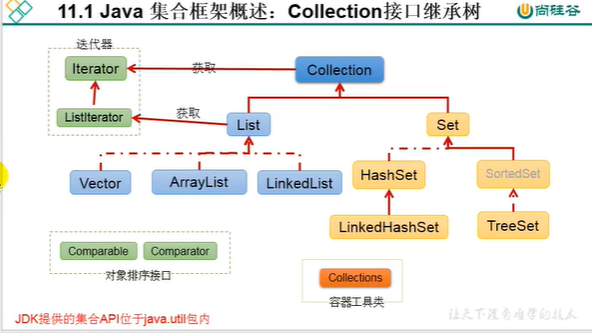
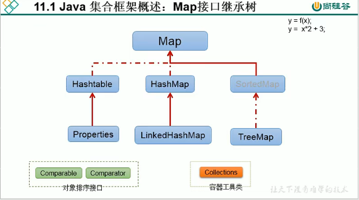

### 集合概述

1.集合、数组都是对多个数据进行存储操作的结构，简称Java容器。

主要指内存层面的存储，不涉及到持久化的存储

2.1数组存储多个数据方面的特点

​	一旦初始化以后，长度就确定了

​	数据一旦定义好，其元素类型也就确定了

2.2弊端

​	初始化后，长度不可修改。	

​	提供的方法有限。对于增删插入操作，非常不便，效率不高

​	获取数组中实际元素的个数的需求，没有现成的属性或方法可用。

​	对于无序、不可重复的需求无法满足。

3.集合存储的优点

解决数组存储数据方面的弊端。

### 集合框架

|----Collection接口：单列集合，用来存储一个一个对象

​		|----List接口：存储有序的、可重复的数据。 ---->"动态"数组

​				|----ArrayList

​				|----LinkedList

​				|----Vector

​		|----Set接口：存储无序的、不可重复的数据  ---->"集合"

​				|----HashSet

​						|----LinkedHashSet

​				|----TreeSet

|----Map接口：双列集合，用来存储一对(key - value)一对的数据   -->函数 y = f(x)

​				|----HashMap

​						|----LinkedHashMap

​				|----TreeMap

​				|----Hashtable

​						|----Properties

