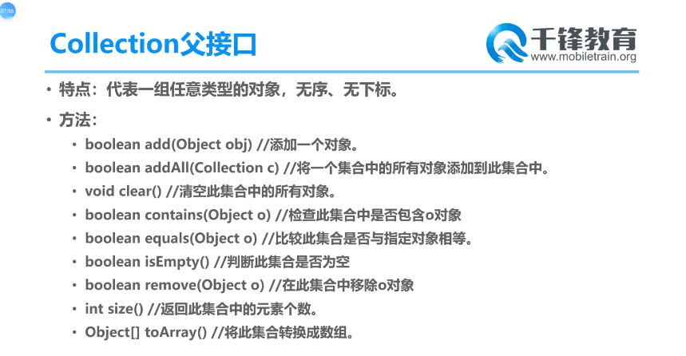

### Collection接口

#### 方法

要提前重写存入集合的类的equals()方法

| add(Object e)               | 将元素e添加到集合中                              |
| --------------------------- | ------------------------------------------------ |
| addAll(Collection coll)     | 将coll集合中的元素添加到当前集合中               |
| size()                      | 获取添加的元素的个数                             |
| clear()                     | 清空集合元素                                     |
| isEmpty()                   | 判断当前集合是否为空(空返回true)                 |
| contains(Object obj )       | 判断当前集合是否包含obj,自建类要重写equals()方法 |
| containsAll(Collection col) | 判断形参col中所有元素是否都存在于当前集合中      |
| remove(Object obj)          | 移除某个元素，要调用equals()方法 ,成功返回ture   |
| removeAll(Collection col)   | 从当前集合移除col中所有的元素                    |
| retainAll(Collection col)   | 保留col的所有元素，移除其他元素                  |
| equals(Object obj)          | 比较集合所有元素，List考虑有序。返回boolean      |
| hashCode()                  | 返回当前对象哈希值                               |
| toArray()                   | 返回Object类型的数组                             |
| iterator()                  | 返回Iterator接口的实例，用于遍历集合元素         |
|                             |                                                  |
|                             |                                                  |

集合转换数组			col.toArray()

数组转换为集合		Arrays.asList(Object[] obj) ,要用包装类或引用类对象 

```java
//remove移除自定义类操作
Collection col = new ArrayList();
col.add(new Person("jerry", 20));
col.remove(new Person("jerry", 20));
```


