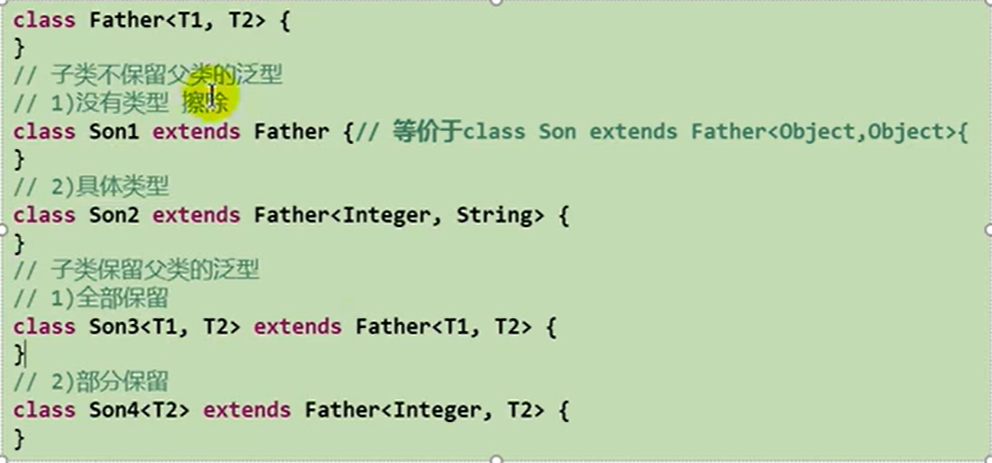
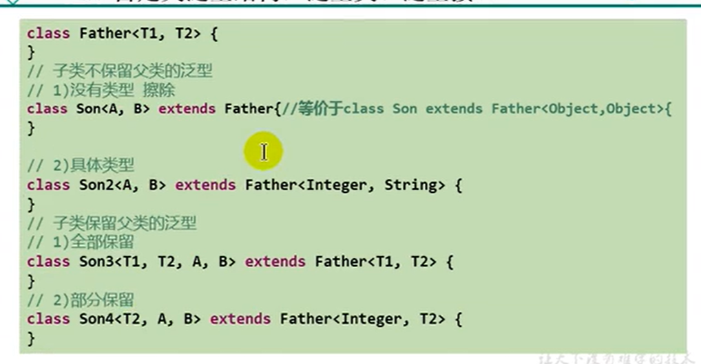

### 泛型在继承方面体现

1.虽然类A是类B的父类，但是G<A> 和 G<B> 二者不具备子父类关系，二者是并列关系。

补充：类A是类B的父类，A<G>  是  B<G>  的父类

List<Object> list1 = null;

List<String> list2 = null;

//此时的list1和list2不具有子父类关系

反证法：

假设 list1 = list2

​	list1.add(123);导致混入非String的数据，出错。

