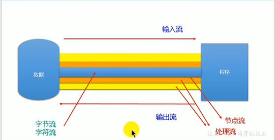
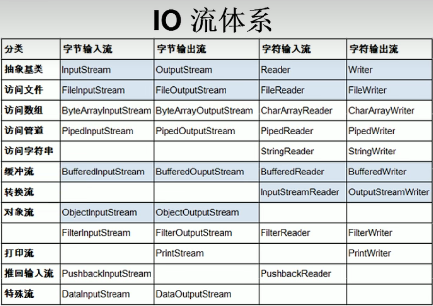

### IO流原理

I/O是Input/Output的缩写，用于处理设备之间的数据传输。

Java程序中，对于数据的输入/输出操作以"流(stream)"的方式进行。

java.io包下提供了各种"流"类和接口，用以获取不同种类的数据，并通过

标准的方法输入或输出数据。

### 流的分类

输入(读入数据）input  

输出(传出数据）output

按操作数据单位不同：字节流(8 bit) --> 图片、视频等,  字符流(16 bit)  -->文本文件

按数据流的流向不同：输入流，输出流

按流的角色的不同分为：节点流，处理流

| 抽象基类 | 字节流       | 字符流 |
| -------- | ------------ | ------ |
| 输入流   | InputStream  | Reader |
| 输出流   | OutputStream | Writer |

1.Java的IO流涉及40多个类，都是从这四个抽象基类派生的

2.这四个类派生的子类名称都是以其父类名作为子类名后缀

### IO流体系

深色是需要重点学习的

