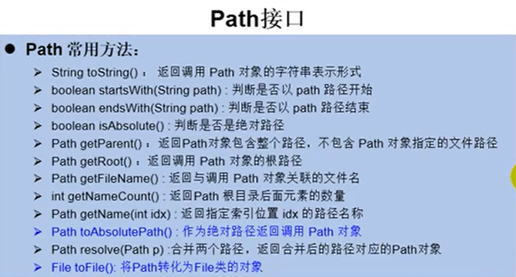
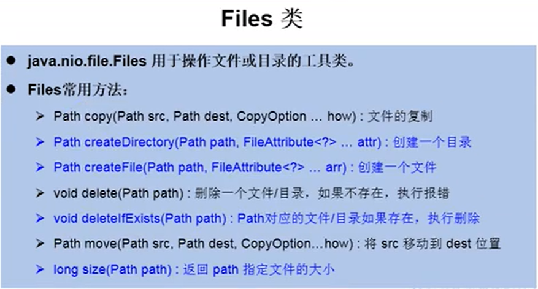
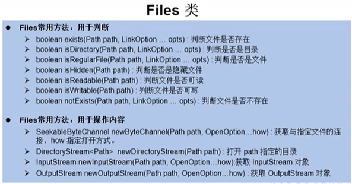

### NIO概述

Java 1.4版本引入的一套新的IO API，可以替代标准的Java IO API

作用和目的一样，但NIO支持面向缓冲区的，会更高效进行文件的读写操作


提供了两套NIO，一套是标准输入输出NIO，一套是网络编程NIO

|----java.nio.channels.Channel

​		|----FileChannel :处理本地文件

​		|----SocketChannel:TCP网络编程的客户端的Channel

​		|----ServerSocketChannel:TCP网络编程的服务器端的Channel

​		|----DatagramChannel:UDP网络编程中发送端和接收端的Channel


NIO.2是JDK7发布的，增强对文件处理和文件系统特性的支持

NIO在文件处理中很重要。


### 对IO操作的升级

引入Path接口，描述了目录结构中文件的位置，可以看为File类的升级版本

以前：

```java
import java.io.File;
File file = new File("index,html");
```

Java7之后：

```java
import java.nio.file.Path;
import java.nio.file.Paths;
Path path = Paths.get("index.html");
```


### Path和File核心API

Paths类提供静态get()方法获取Path对象：

static Path get(String first, String ...more): 用于将多个字符串串连成路径

static Path get(URI uri): 返回指定uri对应的Path路径








