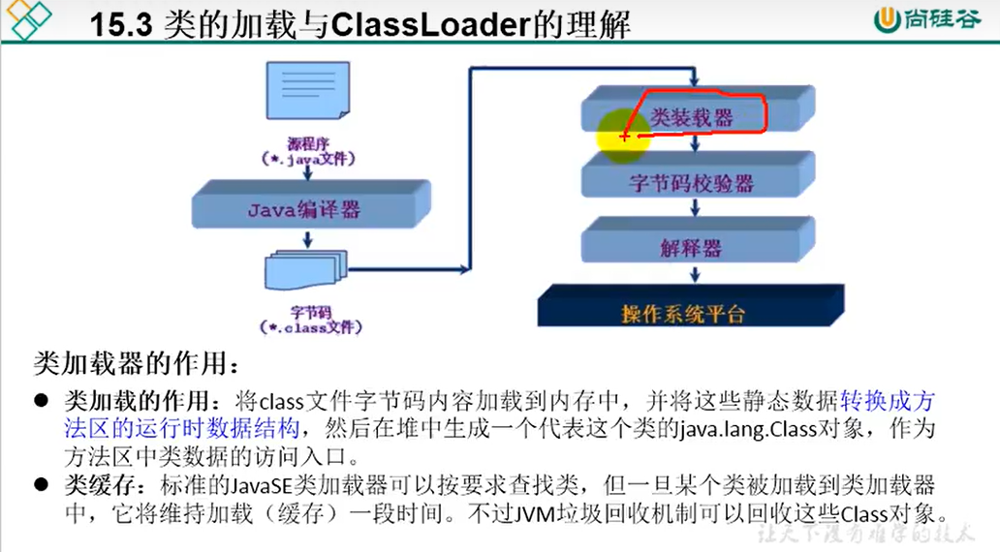

### Class类

java.lang.Class类的理解


1.类的加载过程：

程序经过javac.exe命令以后，会生成一个或多个字节码文件(.class结尾)

接着使用java.exe命令对某个字节码文件进行解释运行。相对于将某个字节码文件加载到内存中

此过程称为类的加载，加载到内存中的类，称为运行时类。

此运行时类，就做为Class类的一个实例。


2.Class的实例就对应着一个运行时类。


3.获取Class的实例的方式

```java
@Test
public void test2() throws ClassNotFoundException {
    //方式一：调用运行时类的属性 .class
    Class<Person> clazz1 = Person.class;

    //方式二：通过运行时类的对象,调用getClass()
    Person p1 = new Person();
    Class clazz2 = p1.getClass();

    //方式三：调用Class的静态方法：forName(String classPath)   //用的多
    Class<?> clazz3 = Class.forName("com.myPractice.Person");
    
    //方式四：使用类的加载器：ClassLoder
    ClassLoader classLoader = ReflectionTest.class.getClassLoader();
    Class<?> clazz4 = classLoader.loadClass("com.myPractice.Person");
    
}
```

加载到内存中的运行时类，会缓存一定的时间。在此时间之内，我们可以通过

不同的调用方式来获取此运行时类。


### 哪些类型有Class对象

1.class：外部类，成员(成员内部类，静态内部类)，局部内部类，匿名内部类

2.interface：接口

3.[]：数组

4.enum：枚举

5.annotation：注解@interface

6.primitive type：基本数据类型

7.void


注意：只要数组的元素类型与维度一样，就是同一个Class


#### 类的加载过程

类的加载(Load)：将类的class文件读入内存，并为之创建一个java.lang.Class对象,类加载器完成


类的链接(Link)：将类的二进制数据合并到JRE中

确保加载的类信息符合JVM规范

正式为类变量(static)分配内存并设置类变量默认初始值的阶段


类的初始化(Initialize)：JVM负责对类进行初始化

执行类构造器< clinit >()方法的过程

当初始化一个类的时候，如果其父类还没有初始化，则需要先触发其父类的初始化。





加载器分类

```java
@Test
public void test2(){

    //对于自定义类，使用系统类加载器进行加载
    ClassLoader classLoader = ReflectionTest.class.getClassLoader();
    System.out.println(classLoader);

    //调用系统类加载器的getParent():获取扩展类加载器
    ClassLoader classLoader1 = classLoader.getParent();
    System.out.println(classLoader1);

    //调用扩展类加载器的getParent():无法获取引导类加载器
    //引导类加载器主要负责加载java的核心类库，无法加载自定义类的
    ClassLoader classLoader2 = classLoader1.getParent();
    System.out.println(classLoader2);

}
```


### 使用ClassLoader加载配置文件

Properties：用来读取配置文件

```java
@Test
    public void test2() throws Exception {
        Properties pros = new  Properties();
        //识别位置默认在当前module下
        //读取配置文件方式1
//        FileInputStream fis = new FileInputStream("jdbc.properties");
//        pros.load(fis);

        ClassLoader classLoader = ReflectionTest.class.getClassLoader();
        //识别位置默认在src下
        InputStream is = classLoader.getResourceAsStream("jdbc.properties");
        pros.load(is);

        String user = pros.getProperty("user");
        String password = pros.getProperty("password");

        System.out.println(user);
        System.out.println(password);
    }
```


### 创建运行时类的对象

通过反射创建对应的运行时类的对象

```java
@Test
public void test() throws Exception {
    Class<Person> clazz = Person.class;
    //newInstance():调用方法，创建对应的运行时类的对象

    //需要:
    //1.提供空参的构造器
    //2，空参的构造器的访问权限足够，通常，设置为public

    //在javabean中要求提供一个public的空参的构造器
    //1，便于反射
    //2，便于子类继承此运行时类时，默认调用super()时，保证父类有此构造器
    Person obj = clazz.newInstance();
    System.out.println(obj);
}
```


