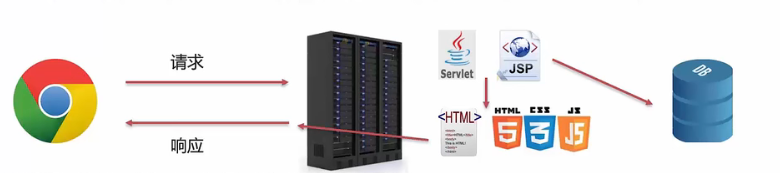

## Web核心介绍

B/S架构：Browser/Server,浏览器/服务器 架构模式，它的特点是，客户端只需要浏览器，应用程序的逻辑和数据都存储在服务器端。浏览器只需要请求服务器，获取Web资源，服务器把Web资源发送给浏览器即可。

好处：易于维护升级，服务器升级后，客户端无需任何部署就可以使用最新的版本。

静态资源：html，css，JavaScript。负责页面展示

动态资源：Servlet、JSP。负责逻辑处理

数据库：负责存储数据

HTTP协议：定义通信规则

Web服务器：负责解析HTTP协议，解析请求数据，并发送响应数据

