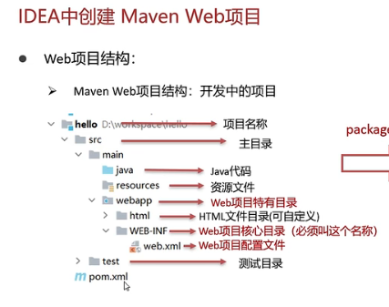
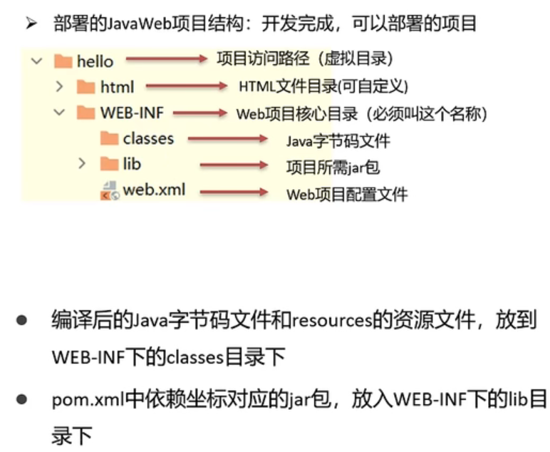
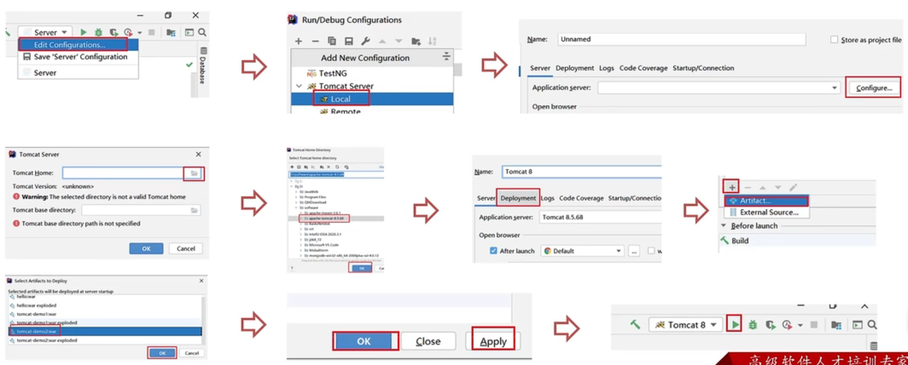

### Tomcat

Web服务器对HTTP协议进行封装，使得程序员不必直接对协议进行操作。

Tomcat是Apache软件基金会一个核心项目，是一个开源免费的轻量级Web服务器，支持Servlet/JSP 。

Tomcat被称为Web容器，Servlet容器。Servlet需要依赖于Tomcat才能运行。

程序路径

D:\Leran\Tomcat\apache-tomcat-8.5.68

#### 部署项目

将项目放置到webapps目录下，即部署完成

一般JavaWeb项目会被打成war包，然后将war包放到webqapps目录下，Tomcat会自动解压war文件

#### IDEA创建Web项目

Web项目结构

开发中的项目

多了一个webapp目录，提供资源的部署

可以部署的项目

开发中的项目经过打包的项目

Run Maven  / package

生成target目录

#### IDEA使用Tomcat

将本地Tomcat集成到idea中，然后进行项目部署

