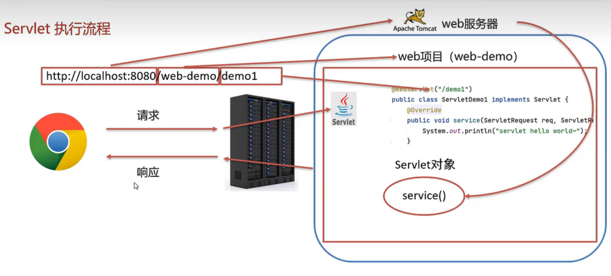

## Servlet

Servlet是Java提供的一门动态web资源开发技术。


Servlet是JavaEE规范之一，其实就是一个接口，

将来我们需要定义Servlet类实现Servlet接口，

并由web服务器运行Servlet


### 导入Servlet

1.创建web项目，导入Servlet依赖坐标

```xml
<dependencies>
  <dependency>
    <groupId>javax.servlet</groupId>
    <artifactId>javax.servlet-api</artifactId>
    <version>3.1.0</version>
    <scope>provided</scope>             //范围为provided
  </dependency>
</dependencies>
```


2.创建：定义一个类，实现Servlet接口，重写方法

```java
public class ServletDemo1 implements Servlet {
    public void service(ServletRequest servletRequest, ServletResponse servletResponse) throws ServletException, IOException {
        System.out.println("hello wooo");
    }
}
```


3.配置：再类上使用@WebServlet注解，配置该Servlet的访问路径

```java
@WebServlet("/demo1")
```


4.访问：启动Tomcat，浏览器输入URL访问该Servlet


### 执行流程




### Servlet生命周期

Servlet运行再Servlet容器(web服务器)中，其生命周期由容器来管理

1：加载和实例化：默认情况下，当Servlet第一次被访问时，由容器创建Servlet对象。


2：初始化：当Servlet实例化之后，容器将调用Servlet的init()方法初始化这个对象，

完成一些如加载配置文件、创建连接等初始化的工作，该方法只调用一次

通过loadOnStartup控制创建时间(-1打开页面时创建，1启动时创建)


3：请求处理：每次请求Servlet时，Servlet容器1都会调用Servelt的service()方法对请求处理


4：服务终止：当需要释放内存或者容器关闭时，容器就会调用Servlet实例的destroy()方法完成资源的释放。在destroy()方法调用之后，容器会释放这个Servlet实例，该实例随后会被Java的垃圾收集器回收。


### Servlet方法

| void init(ServletConflg conflg)                      | 初始化方法，只执行一次     |
| ---------------------------------------------------- | -------------------------- |
| void service(ServletRequest req,ServletResponse res) | 提供服务方法，每次调用执行 |
| void destroy()                                       | 销毁方法                   |
| ServletConflg getServletConflg()                     | 获取ServletConfig对象      |
| String getServletInfo()                              | 获取Servlet信息            |


### Servlet体系结构

Servlet  体系根接口

GenericServlet  Servlet抽象实现类

HttpServlet     对HTTP协议封装的Servlet实现类

​	----继承HttpServlet

​	----重写doGet和doPost方法

HttpServlet原理

​	获取请求方式，并根据不同的请求方式，调用不同的doXxx方法


开发B/S架构的web项目，都是针对HTTP协议

所有自定义Servlet，会继承HttpServlet


### urlPattern配置

Servlet要想被访问，必须配置其访问路径(urlPattern)

1.一个Servlet,可以配置多个urlPattern

@WebServlet(urlPatterns = {"/demo1","demo2"})


2.urlPattern 配置规则

1.精确匹配(优先级最高)

和访问路径要一样。


2.目录匹配

@WebServlet("/user/*")

访问user路径下的什么目录都匹配


3.扩展名匹配

@WebServlet("*.Xxx")

匹配以.Xxx为后缀的页面


4.任意匹配 (优先级最低)

@WebServlet(" /  '')

@WebServlet(" / *'')   (大于/)

/ 和  /* 区别：

当项目中的Servlet配置了"/",会覆盖掉tomcat中的DefaultServlet

当其他的url-pattern都匹配不上时都会走这个Servlet

当项目中配置了"/*",意味着匹配任意访问路径


### XML配置Servlet

已淘汰

3.0版本后支持注解配置


1.编写Servlet类

2.在web.xml中配置该Servlet

```xml
<servlet>  
    <servlet-name>demo1</servlet-name>
    <servlet-class>com.web.ServletDemo1</servlet-class>
  </servlet>
  
  <servlet-mapping>
    <servlet-name>demo1</servlet-name>
    <url-pattern>/demo1</url-pattern>
  </servlet-mapping>
```

