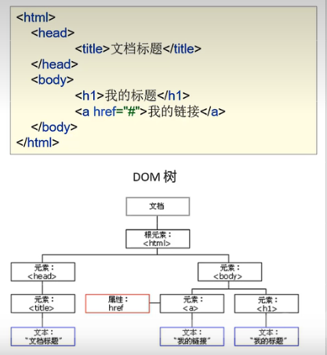

### JavaScript对象

#### 本地对象和内置对象

##### Array

```javascript
var 变量名 = new Array(元素列表); //方式一
var 变量名 = [元素列表];    //方式二

var arr = new Array(1,2,3);
var arr = [1,2,3];

arr[索引] = 值;
arr[0] = 1;
```

注意：JS数组类似于Java集合、长度、类型都可变


| Array属性   | 描述                                   |
| ----------- | -------------------------------------- |
| constructor | 返回创建 Array 对象原型的函数。        |
| length      | 设置或返回数组中元素的数量。(遍历数组) |
| prototype   | 允许您向数组添加属性和方法。           |


| Array方法  | 描述                                         |
| ---------- | -------------------------------------------- |
| concat()   | 连接两个或多个数组，并返回已连接数组的副本。 |
| join()     | 将数组的所有元素连接成一个字符串。           |
| pop()      | 删除数组的最后一个元素，并返回该元素。       |
| push()     | 将新元素添加到数组的末尾，并返回新的长度。   |
| reverse()  | 反转数组中元素的顺序。                       |
| shift()    | 删除数组的第一个元素，并返回该元素。         |
| sort()     | 对数组的元素进行排序。                       |
| toString() | 将数组转换为字符串，并返回结果。             |
| valueOf()  | 返回数组的原始值。                           |


##### String

```javascript
var 变量名 = new String(s); //方式一
var 变量名 = s //方式二

var str = new String("hello");
var str = "hello";
```


| String属性  | 描述                       |
| ----------- | -------------------------- |
| constructor | 对创建该对象的函数的引用   |
| length      | 字符串的长度               |
| prototype   | 允许您向对象添加属性和方法 |


| String方法  | 描述                                     |
| ----------- | ---------------------------------------- |
| charAt()    | 返回在指定位置的字符。                   |
| indexOf()   | 检索字符串。                             |
| match()     | 找到一个或多个正则表达式的匹配。         |
| replace()   | 替换与正则表达式匹配的子串。             |
| split()     | 把字符串分割为字符串数组。               |
| substr()    | 从起始索引号提取字符串中指定数目的字符。 |
| substring() | 提取字符串中两个指定的索引号之间的字符。 |
| trim()      | 去除字符串前后两端的空白字符             |


##### 自定义对象

```javascript
var 对象名称 = {
		属性名称1:属性值1，
		属性名称2:属性值2,
		....
		函数名称:function(形参列表){}
		....
};

var person = {
	name:"zhangsan",
	age:23,
	eat:function(){
		alert("飞~");
	}
};
```


#### BOM

浏览器对象模型 Browser Object Model 

JavaScript将浏览器的各个组成部分封装为对象

组成：

1.Window: 浏览器窗口对象
2.Navigator: 浏览器对象

3.Screen: 屏幕对象

4.History: 历史记录对象

5.Location: 地址栏对象


##### Window

获取：直接使用window，其中window.可以省略

window.alert("abc");


| alert()                       | 显示带有一段消息和一个确认按钮的警告框                      |
| ----------------------------- | ----------------------------------------------------------- |
| comfirm()                     | 显示带有一段消息和确认按钮和取消按钮的对话框，返回boolean型 |
| setInterval(function ,毫秒值) | 按照指向的周期来调用函数或计算表达式                        |
| setTimeout(function,毫秒值)   | 在指定毫秒后调用函数或计算表达式                            |


##### History

获取：history.方法();

| back()    | 加载history列表中的前一个URL,后退  |
| --------- | ---------------------------------- |
| forward() | 加载history列表中的下一个URL，前进 |


##### Location

获取：location.方法()

| href | 设置或返回完整的URL |
| ---- | ------------------- |
|      |                     |


#### DOM!!

Document Object Moder 文档对象模型

将标记语言的各个组成部分封装为对象

Document：整个文档对象

Element：元素对象

Attribute：属性对象

Text：文本对象

Comment：注释对象




JavaScript通过DOM，就能够对HTML进行操作了

1.改变HTML元素的内容

2.改变HTML元素的样式(css)

3.对HTML DOM事件作出反应

4.添加和删除HTML元素


##### 获取Element

1.Element：元素对象

2.获取：使用Document对象的方法来获取

| getElementById()         | 根据id属性值获取，返回一个Element对象    |
| ------------------------ | ---------------------------------------- |
| getElementsByTagName()   | 根据标签名称获取，返回Element对象数组    |
| getElementsByName()      | 根据name属性值获取，返回Element对象数组  |
| getElementsByClassName() | 根据class属性值获取，返回Element对象数组 |

```js
var img = document.getElementById("light");

var divs = document.getElementsByTagName("div");

var hobbys = document.getElementsByName("hoppy"); //name = "hoppy"

var clss = document.getElementsByClassName("cls");
```


##### 常见对象的使用

element

| element.innerHTML | 设置或返回元素的内容          |
| ----------------- | ----------------------------- |
| element.style     | 设置或返回元素的 style 属性。 |
| element.innerText | 设置或返回元素的文本内容      |

```js
var divs = document.getElementsByTagName("div");

for(let i = 0;i < divs.length; i++){
    divs[i].style.color = 'red';
    div[i].innerHTML = "大飞";
}
```


img

```js
var img = document.getElementById("light");
img.src = "../imgs/on.gif";
```


Checkbox

```html
<input type="checkbox" name="hobby">电影
<input type="checkbox" name="hobby">旅游
<input type="checkbox" name="hobby">游戏
```


```js
var hobbys = document.getElementsByName("hoppy");
for(let i = 0;i < hobbys.length; i++){
    hobbys[i].checked = true;
}
```


更多属性查阅文档

[HTML DOM Element 对象 (w3school.com.cn)](https://www.w3school.com.cn/jsref/dom_obj_all.asp)


#### 事件监听

事件：HTML事件是发生在HTML元素上的"事情"。比如：

1.按钮被点击

2.鼠标移动到元素之上

3.按下键盘按钮

事件监听：JavaScript可以在事件被侦测到时执行代码


##### 事件绑定

分为两种方式：

方式一：通过HTML标签中的事件属性进行绑定

```js
<input type="button" onclick='on()'>

function on(){
	alert("点击事件");
}
```


方式二：通过DOM元素属性绑定  **!!** **推荐使用**

```js
<input type="button" id="btn">
    
document.getElementById("btn").onclick = function(){
	alert("点击事件");
}
```


##### 常见事件

| 事件属性    | 描述                         |
| ----------- | ---------------------------- |
| onblur      | 元素失去焦点                 |
| onfocus     | 元素获得焦点                 |
| onchange    | 域的内容被改变               |
| onclick     | 单击某个对象时调用的事件句柄 |
| ondblclick  | 双击某个对象时调用的事件句柄 |
| onkeydown   | 某个键盘按键被按下           |
| onmouseover | 鼠标移到某元素之上           |
| onmouseout  | 鼠标从某元素移开             |
| onsubmit    | 确认按钮被点击               |

