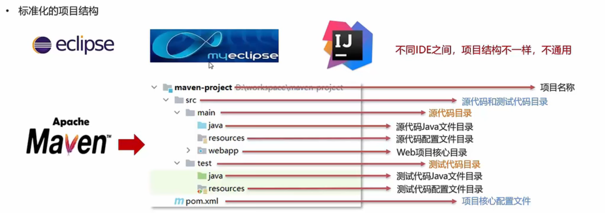
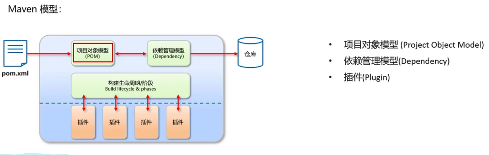

### Maven概述

Maven是专门用于管理和构建Java项目的工具，它的主要功能有：

#### 一

提供了一套标准化的项目结构

使所有IDE使用Maven构建的项目结构完全一样，所有IDE创建的Maven项目可以通用

#### 二

提供了一套标准化的构建流程(编译，测试，打包，发布。。。。)

Maven提供了一套命令来快速项目构建

#### 三

提供了一套依赖管理机制

依赖管理：管理你项目所依赖的第三方资源(jar包，插件...)

1.下载jar包

2.复制jar包到项目

3.将jar包加入工作环境

1.Maven使用标准的坐标配置来管理各种依赖

2.只需要简单的配置就可以完成依赖管理

通过pom.xml导入jar包

### Maven简介

Apache Maven是一个项目管理和构建**工具**，基于项目对象模型(POM)概念

 

仓库分类

本地仓库：自己计算机上的一个目录

中央仓库：由Maven团队维护的全球唯一仓库  https://repo1.maven.org/maven2/

远程仓库(私服)：一般由公司团队搭建的私有仓库

搭建远程仓库，jar包的查找顺序变为：

本地仓库 -> 远程仓库 -> 中央仓库