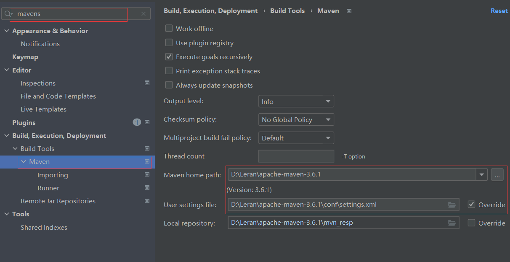

## Maven配置


### 安装

解压安装包

配置环境变量

配置本地仓库：修改conf/settings.xml中的<**localRepository**>为一个指定目录

配置阿里云私服：修改conf/settings.xml中的<**mirrors**>标签，为其添加如下

```
<mirror>
		 <id>alimaven</id>
		 <name>aliyun maven</name>
		 <url>http://maven.aliyun.com/nexus/content/groups/public/</url>
		 <mirrorOf>central</mirrorOf>
	 </mirror>
```


### Maven基本使用

#### 常用命令

compile：编译

clean：清理

test：测试

package：打包

install：安装


#### 生命周期

pre-clean -> clean -> post-clean

compile -> test -> package -> install

pre-site -> site -> site -> post-site

site：产生报告

同一生命周期，执行后边的命令，前边的所有命名会自动执行


## IDEA配置Maven

### 配置环境




### Maven坐标详解

坐标：

Maven中的坐标是资源的唯一标识

使用坐标来定义项目或引入项目中需要的依赖


在dependency中：

gruopId：定义当前Maven项目隶属组织名称(通常是域名反写)

artifactId：定义当前Maven项目名称(通常是模块名称，例如order-service、goods-service)

version：定义当前项目版本号


#### IDEA创建Macen项目

1.创建模块，选择Maven，点击Next    shift+ctrl+alt+s

2.填写模块名称，坐标信息，点击finish，创建完成

3.编写文件


#### IDEA导入Maven项目

1.选择Maven面板，点击+号

​     View -> Appearance -> Tool Window Bars

2.选中对应项目的pom.xml文件，双击即可


#### 依赖管理

[https://mvnrepository.com](https://mvnrepository.com?spm=a2c6h.12873639.article-detail.6.31a85a29y3yzyS)

该网站可以查看所有依赖

1.在pom.xnl中编写<**dependencles**>标签

2.在<**dependencies**>标签中使用<**dependency**>引入坐标

3.定义坐标的groupId, artifactId,version

4.点击刷新，使坐标生效

alt+insert 选择dependecy


#### 依赖范围

scope标签，可以设置jar包的作用范围

| 依赖范围 | 编译classpath | 测试classpath | 运行classpath |
| -------- | ------------- | ------------- | ------------- |
| compile  | Y             | Y             | Y             |
| test     |               | Y             |               |
| provided | Y             | Y             |               |
| runtime  |               | Y             | Y             |
| system   | Y             | Y             |               |

import 引入DependencyManagement

默认值：compile


provided 依赖只有在当JDK 或者一个容器已提供该依赖之后才使用。

例如， 如果你开发了一个web 应用，你可能在编译classpath 中需要可用的Servlet API 来编译一个servlet，但是你不会想要在打包好的WAR 中包含这个Servlet API；这个Servlet API JAR 由你的应用服务器或者servlet 容器提供。已提供范围的依赖在编译classpath （不是运行时）可用。它们不是传递性的，也不会被打包。
