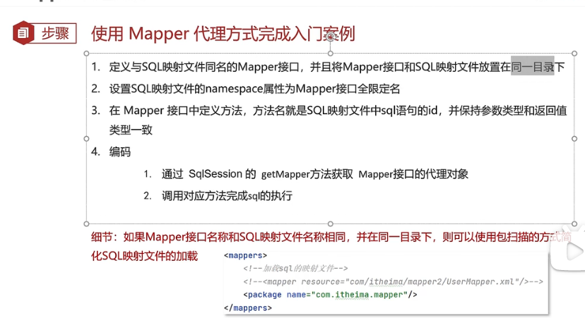

## MaBatis使用


### Mapper代理开发

目的

解决原始方式中的硬编码问题

简化后期执行SQL





### MyBatis核心配置文件

enviroments：配置数据库连接环境信息，可以配置多个enviroment，通过default属性切换不同的environment

```xml
<environments default="development">
    <environment id="development">
        <transactionManager type="JDBC"/>
        <dataSource type="POOLED">
            <property name="driver" value="com.mysql.jdbc.Driver"/>
            <property name="url" value="jdbc:mysql://localhost:13306/mybatis?useSSL=false&amp;useServerPrepStmts=true"/>
            <property name="username" value="root"/>
            <property name="password" value="200092"/>
        </dataSource>
    </environment>
</environments>
```


typeAliases：扫描包，之后可以省略包的前缀

```xml
<typeAliases>
	<package name="com.itheima.pojo"/>
</typeAliases>
```


### 配置文件完成CRUD


### 注解实现CRUD