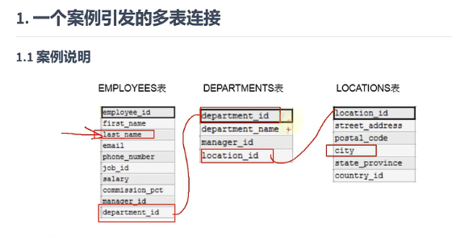
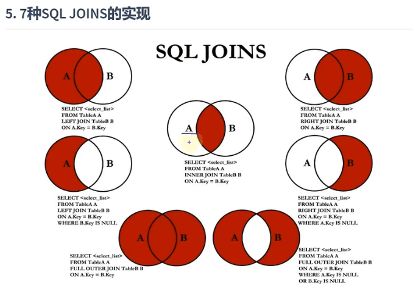

### 多表查询

多表查询，也称为关联查询，指两个或更多个表一起完成查询操作。

前提：一起查询的表之间是有关系的(一对一，一对多)，它们之间一定是有关联字段。




### 多表查询实现

错误方式：每个员工都与每个部门匹配了一遍

出现笛卡尔积的错误

```mysql
#错误
SELECT employee_id,department_name
FROM employees,departments;

#正确，需要有连接条件
SELECT employee_id,department_name
FROM employees,departments
WHERE employees.`department_id` = departments.`department_id`;
```

笛卡尔积的错误在下面条件下产生：

1.省略多个表的连接条件(或关联条件)

2.连接条件(或关联条件)无效

3.所有表中的所有行互相连接


为了避免笛卡尔积，可以在**WHERE加入有效的连接条件**

加入连接条件后，查询语法：

```mysql
SELECT table1.column, table2.column
FROM table1,table2
WHERE table1.column1 = table2.column2;  #连接条件
```


```mysql
SELECT employees.employee_id,department_name,emplpyees.department_id
FROM employees,departments
WHERE employees.`department_id` = departments.`department_id`;
```

#建议：**从sql优化的角度，建议多表查询时，每个字段前都指明其所在的表。**

4.多个表共有的字段一定要加上所在表


5.可以给表起别名，在FROM起别名， 在SELECT和WHERE中使用表的别名

如果给表起了别名，则必须使用表的别名，而不能使用表的别名

```mysql
SELECT  emp.employee_id,dept.department_name,emp.department_id
FROM  employees emp,departments dept
WHERE	emp.department_id = dept.department_id;
```


6.结论：如果有n个表实现多表的查询，则需要至少n-1个连接条件

查询员工的employee_id,last_name,department_name,city（三个表查询）

```mysql
SELECT employee_id,last_name,department_name,city
FROM employees e,departments d,locations l
WHERE e.department_id = d.department_id
AND  d.location_id = l.location_id
```


### 多表查询分类

#### 等值连接VS非等值连接

上面的都是等值连接

非等值连接的例子：

```mysql
SELECT e.last_name,e.salary,j.grade_level
FROM employees e,job_grades j
WHERE e.salary BETWEEN j.lowest_sal AND j.highest_sal
ORDER BY grade_level DESC;
#WHERE e.salary >= lowest_sal AND e.salary <= j.highest_sal;
```

值对不上时，通过比较运算符进行范类概况


#### 自连接VS非自连接

上面的都是非自连接

自连接，自己连接自己：

```mysql
SELECT emp.employee_id,emp.last_name,mgr.employee_id,mgr.last_name
FROM employees emp,employees mgr
WHERE emp.manager_id = mgr.`employee_id`;
```


#### 内连接VS外连接！！！

内连接：合并具体同一列的两个以上的表的行，**结果集不包含一个表与另一个表不匹配的行**

```mysql
SELECT employee_id,department_name
FROM employees e,department d
WHERE e.department_id = d.department_id;
#sql92实现内连接
```


外连接：合并具体同一列的两个以上的表的行，结果集除了包含一个表与另一个表匹配的行之外

​				还查询到了左表或右表中不匹配的行。

​				没有匹配的行时，结果表中相应的列为空(NULL)

外连接的分类：

1.左外连接

返回左表不满足条件的行

连接条件中左边的表称为主表，右边的表称为从表


2.右外连接

返回右表不满足条件的行

连接条件中右边的表称为主表，左边的表称为从表


3.满外连接


##### SQL92实现外连接

使用 + -------------MySQL不支持SQL92语法中外连接的写法

```sql
SELECT employee_id,department_name
FROM employees e,department d
WHERE e.department_id = d.department_id(+);
```


##### SQL99实现多表连接

SQL99语法中使用JOIN.....ON的方式实现多表的查询。

这种方式也能解决外连接的问题。MySQL支持这种方式

###### 内连接

```mysql
SELECT last_name,department_name,city
FROM employees e INNER JOIN departments d
ON e.department_id = d.department_id
JOIN locations l
ON d.location_id = l.location_id;
```

INNER可省略


###### 外连接

```mysql
#左外连接
SELECT employee_id,department_name
FROM employees e LEFT OUTER JOIN departments d
ON e.`department_id` = d.`department_id`;

#右外连接
SELECT employee_id,department_name
FROM employees e RIGHT OUTER JOIN departments d
ON e.`department_id` = d.`department_id`;

#满外连接:mysql不支持FULL OUTER JOIN
#SELECT last_name,department_name
#FROM employees e FULL OUTER JOIN departments d
#ON e.`department_id` = d.`department_id`;

#mysql需要借助其他JOIN..ON..方式实现满外连接

```

OUTER可省略


### UNION关键字

合并查询结果

利用UNION关键字，可以给出多条SELECT语句，并将它们的结果组合成单个结果集。

合并时，两个表对应的列数和数据类型必须相同，并且相互对应。

各个SELECT语句之间使用UNION或UNION ALL关键字分隔。

语法格式：

```mysql
SELECT column,... FROM table1
UNION [ALL]
SELECT column,... FROM table2
```

UNION 返回查询结果集的并集，去除重复记录

UNION ALL 返回查询结果集的并集，不去重   （更快，建议使用）


### 7种JOINS实现



```mysql
#中图
SELECT employee_id,department_name
FROM employees e JOIN departments d
ON e.department_id = d.department_id;

#左上图:左外连接
SELECT employee_id,department_name
FROM employees e LEFT JOIN departments d
ON e.department_id = d.department_id;

#右上图:右外连接
SELECT employee_id,department_name
FROM employees e RIGHT JOIN departments d
ON e.department_id = d.department_id;

#左中图：
SELECT employee_id,department_name
FROM employees e LEFT JOIN departments d
ON e.department_id = d.department_id
WHERE d.department_id IS NULL;

#右中图：
SELECT employee_id,department_name
FROM employees e RIGHT JOIN departments d
ON e.department_id = d.department_id
WHERE e.department_id IS NULL;

#左下图
#方式1：左上图 UNION ALL 右中图
SELECT employee_id,department_name
FROM employees e LEFT JOIN departments d
ON e.department_id = d.department_id
UNION ALL
SELECT employee_id,department_name
FROM employees e RIGHT JOIN departments d
ON e.department_id = d.department_id
WHERE e.department_id IS NULL;

#右下图
#左中图 UNION ALL 右中图
SELECT employee_id,department_name
FROM employees e LEFT JOIN departments d
ON e.department_id = d.department_id
WHERE d.department_id IS NULL
UNION ALL
SELECT employee_id,department_name
FROM employees e RIGHT JOIN departments d
ON e.department_id = d.department_id
WHERE e.department_id IS NULL;
```


### SQL99新特性

1.**自然连接**

会帮你自动查询两张连接表中所有相同的字段，然后进行等值连接。

```mysql
SELECT employee_id,last_name,department_name
FROM employees e NATURAL JOIN departmrnts d;
```


**2.USING连接**

USING可以替代 ON...

用来替代连接条件,只能和JOIN一起使用

```mysql
SELECT employee_id,last_name,department_name
FROM employees e JOIN departments d
USING (department_id);
```


