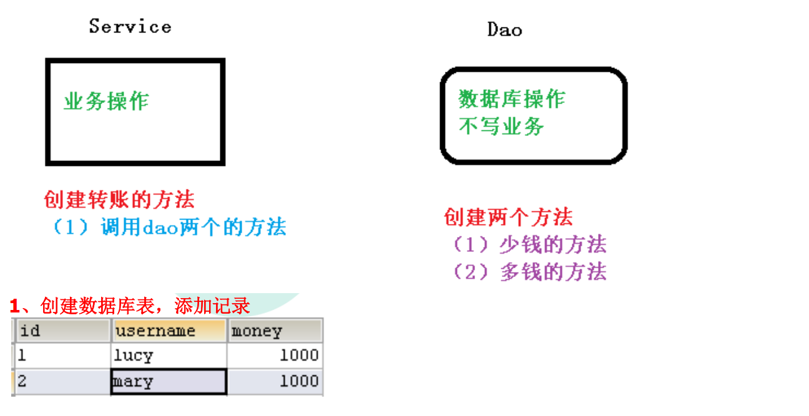
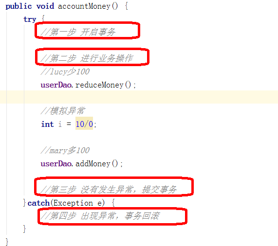
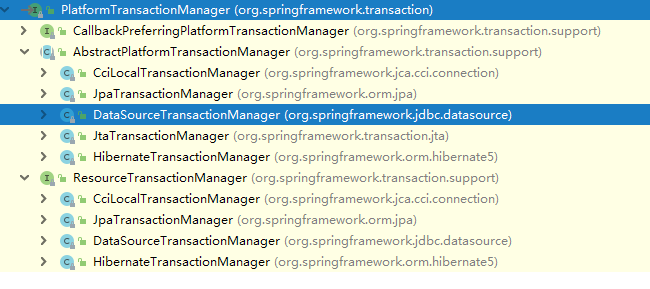
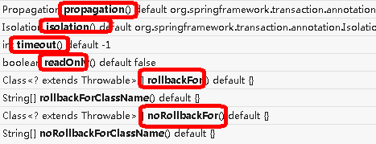
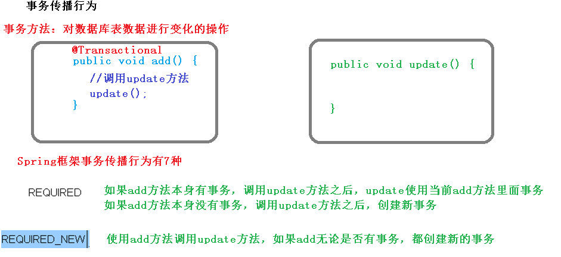
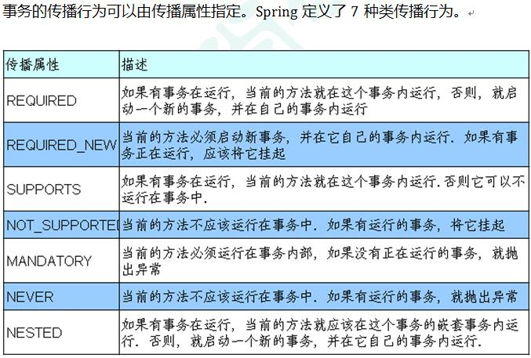
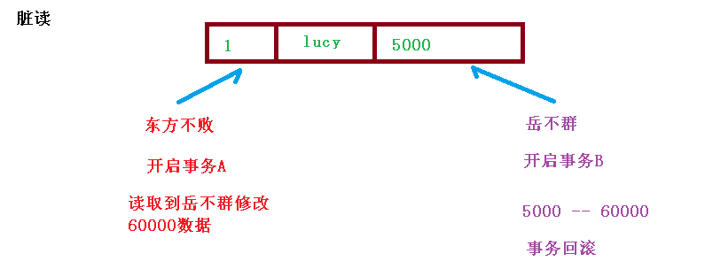
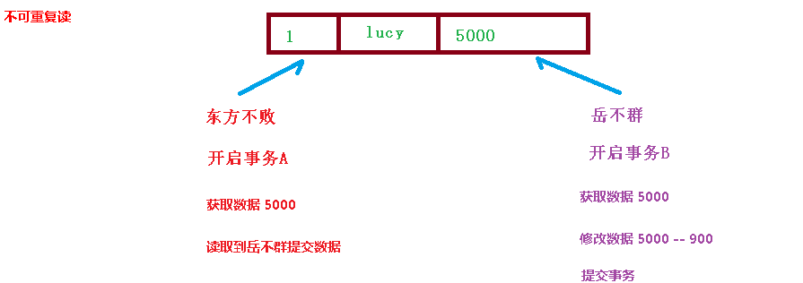
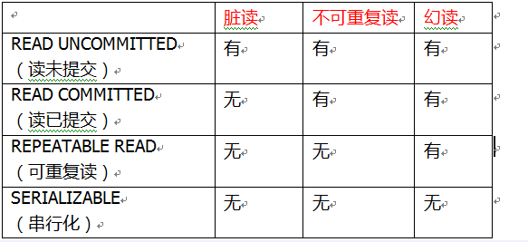

## 事务操作  

1、什么事务

（ 1）事务是数据库操作最基本单元，

​			逻辑上一组操作，要么都成功，如果有一个失败,所有操作都失败


（2）典型场景：银行转账

* lucy 转账 100 元 给 mary 
* lucy 少 100， mary 多 100


2、事务四个特性（ACID） 

（1）原子性 	Atomicity        一个不成功都不成功

（2）一致性 	consistency	 总量不变

（3）隔离性 	Isolation			多事务不会相互影响

（4）持久性	Durability			数据库进行了变更，持久保存下来了

​	

### （搭建事务操作环境）  



2、创建 service，搭建 dao，完成对象创建和注入关系

（1） service 注入 dao，在 dao 注入 JdbcTemplate，在 JdbcTemplate 注入 DataSource

```java
@Service
public class UserService {
	//注入 dao
	@Autowired
	private UserDao userDao;
}
@Repository
public class UserDaoImpl implements UserDao {
	@Autowired
	private JdbcTemplate jdbcTemplate;
}
```


3 、在 dao 创建两个方法：多钱和少钱的方法，在 service 创建方法（转账的方法）

```java
@Repository
public class UserDaoImpl implements UserDao {
	@Autowired
	private JdbcTemplate jdbcTemplate;
	//lucy 转账 100 给 mary
	//少钱
	@Override
	public void reduceMoney() {
		String sql = 
		"update t_account set money=money-? where username=?";
		jdbcTemplate.update(sql,100,"lucy");
}
	//多钱
	@Override
	public void addMoney() {
		String sql = 
		"update t_account set money=money+? where username=?";
		jdbcTemplate.update(sql,100,"mary");
	}
}
@Service
public class UserService {
	//注入 dao
	@Autowired
	private UserDao userDao;
	//转账的方法
	public void accountMoney() {
	//lucy 少 100
	userDao.reduceMoney();
	//mary 多 100
	userDao.addMoney();
	}
}
```


4 、上面代码，如果正常执行没有问题的，但是如果代码执行过程中出现异常，有问题


（1）上面问题如何解决呢？

 * 使用事务进行解决

（2）事务操作过程




### （Spring 事务管理介绍）  

1、事务添加到 JavaEE 三层结构里面 Service 层（业务逻辑层）


2、在 Spring 进行事务管理操作 

（1）有两种方式： 编程式事务管理    //通过代码来写

​							   和声明式事务管理（使用）


3、声明式事务管理 

（1）基于注解方式（使用） 

（2）基于 xml 配置文件方式


4、在 Spring 进行声明式事务管理，底层使用 AOP 原理

​		**在Spring事务管理中就用到了AOP原理**


5、 Spring 事务管理 API 

（1）提供一个接口，代表事务管理器，这个接口针对不同的框架提供不同的实现类




### 注解声明式事务管理 

1、在 spring 配置文件配置事务管理器

```xml
<!--创建事务管理器-->
<bean id="transactionManager"
class="org.springframework.jdbc.datasource.DataSourceTransactionManager">
<!--注入数据源-->
<property name="dataSource" ref="dataSource"></property>
</bean>
```


2、 在 spring 配置文件，开启事务注解 

（1）在 spring 配置文件引入名称空间 tx

```xml
<beans xmlns="http://www.springframework.org/schema/beans"
	xmlns:xsi="http://www.w3.org/2001/XMLSchema-instance"
	xmlns:context="http://www.springframework.org/schema/context"
	xmlns:aop="http://www.springframework.org/schema/aop"
	xmlns:tx="http://www.springframework.org/schema/tx"
	xsi:schemaLocation="http://www.springframework.org/schema/beans
http://www.springframework.org/schema/beans/spring-beans.xsd
						http://www.springframework.org/schema/context
http://www.springframework.org/schema/context/spring-context.xsd
						http://www.springframework.org/schema/aop
http://www.springframework.org/schema/aop/spring-aop.xsd
						http://www.springframework.org/schema/tx
http://www.springframework.org/schema/tx/spring-tx.xsd">
```


（2）开启事务注解 

```xml
<!--开启事务注解-->
<tx:annotation-driven transactionmanager="transactionManager"></tx:annotation-driven>
```


3、在 service 类上面（ 或者 service 类里面方法上面）添加事务注解 

（1） @Transactional，这个注解添加到类上面，也可以添加方法上面 

（2）如果把这个注解添加类上面，这个类里面所有的方法都添加事务 

（3）如果把这个注解添加方法上面，为这个方法添加事务

```java
@Service
@Transactional
public class UserService {
```


#### 声明式事务管理参数配置  

1、在 service 类上面添加注解@Transactional，在这个注解里面可以配置事务相关参数



2、 propagation：事务传播行为 

（ 1）多事务方法直接进行调用，这个过程中事务 是如何进行管理的





```java
@Service
@Transactional(propagation = Propagation.REQUIRED)
public class UserService {}
```


3、 ioslation：事务隔离级别 

（1）事务有特性成为隔离性，多事务操作之间不会产生影响。不考虑隔离性产生很多问题


 （2）有三个读问题：脏读、不可重复读、虚（幻）读 

（3）脏读：一个未提交事务读取到另一个未提交事务的数据



（4）不可重复读：一个未提交事务读取到另一提交事务修改数据



（5）虚读：一个未提交事务读取到另一提交事务添加数据 

（6） 解决： 通过设置事务隔离级别，解决读问题




4、 timeout：超时时间 

（1）事务需要在一定时间内进行提交，如果不提交进行回滚 

（2）默认值是 -1 ，设置时间以秒单位进行计算


5、 readOnly：是否只读 

（1）读：查询操作，写：添加修改删除操作 

（2） readOnly 默认值 false，表示可以查询，可以添加修改删除操作 

（3）设置 readOnly 值是 true，设置成 true 之后，只能查询


6、 rollbackFor：回滚 

（1）设置出现哪些异常进行事务回滚  

7、 noRollbackFor：不回滚 

（1）设置出现哪些异常不进行事务回滚


#### XML 声明式事务管理  

1、在 spring 配置文件中进行配置 

第一步 配置事务管理器 

第二步 配置通知

第三步 配置切入点和切面

```java
<!--1 创建事务管理器-->
<bean id="transactionManager"
class="org.springframework.jdbc.datasource.DataSourceTransactionManager">
	<!--注入数据源-->
	<property name="dataSource" ref="dataSource"></property>
</bean>
    
<!--2 配置通知-->
<tx:advice id="txadvice">
	<!--配置事务参数-->
	<tx:attributes>
		<!--指定哪种规则的方法上面添加事务-->
		<tx:method name="accountMoney" propagation="REQUIRED"/>
		<!--<tx:method name="account*"/>-->
	</tx:attributes>
</tx:advice>

<!--3 配置切入点和切面-->
<aop:config>
	<!--配置切入点-->
	<aop:pointcut id="pt" expression="execution(*
com.atguigu.spring5.service.UserService.*(..))"/>
	<!--配置切面-->
	<aop:advisor advice-ref="txadvice" pointcut-ref="pt"/>
</aop:config>
```


#### 完全注解声明式事务管理  

1、创建配置类，使用配置类替代 xml 配置文件

```java
@Configuration //配置类
@ComponentScan(basePackages = "com.atguigu") //组件扫描
@EnableTransactionManagement //开启事务
public class TxConfig {
	//创建数据库连接池
	@Bean
	public DruidDataSource getDruidDataSource() {
		DruidDataSource dataSource = new DruidDataSource();
		dataSource.setDriverClassName("com.mysql.jdbc.Driver");
		dataSource.setUrl("jdbc:mysql:///user_db");
		dataSource.setUsername("root");
		dataSource.setPassword("root");
		return dataSource;
	}
	//创建 JdbcTemplate 对象
	@Bean
	public JdbcTemplate getJdbcTemplate(DataSource dataSource) {
		//到 ioc 容器中根据类型找到 dataSource
		JdbcTemplate jdbcTemplate = new JdbcTemplate();
		//注入 dataSource
		jdbcTemplate.setDataSource(dataSource);
		return jdbcTemplate;
	}
	//创建事务管理器
	@Bean
	public DataSourceTransactionManager
        
	getDataSourceTransactionManager(DataSource dataSource) {
		DataSourceTransactionManager transactionManager = 
            						new DataSourceTransactionManager();
		transactionManager.setDataSource(dataSource);
		return transactionManager;
	}
}
```


